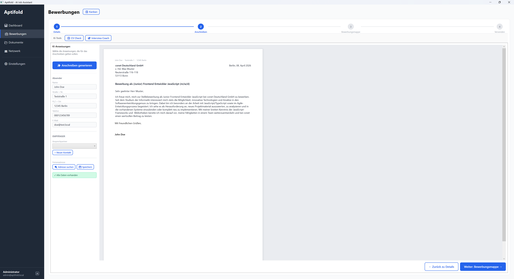

# Aptifold

  

**Aptifold** ist ein KI-gestütztes Bewerbungsmanagement-System, das Benutzer dabei unterstützt, ihre Jobsuche zu organisieren, zu verwalten und zu optimieren. Die Plattform kombiniert klassisches Bewerbungstracking mit KI-Features wie automatischer Anschreiben-Generierung, Lebenslauf-Analyse und Interview-Coaching.

---

## Technologien

| Ebene             | Technologie                                                 |
|-------------------|-------------------------------------------------------------|
| Backend           | ASP.NET Core 10, Entity Framework Core 9, MediatR (CQRS)    |
| Desktop-Client    | WPF mit Prism (MVVM), LiveChartsCore                        |
| Admin-Tool        | WinForms                                                     |
| Mobile App        | Flutter (iOS, Android, Web, Desktop)                         |
| Datenbank         | MySQL (3 Schemas: Auth, Business, Logs)                      |
| Cache             | Redis                                                        |
| KI                | Google Gemini                                                |
| Hintergrundaufgaben | Hangfire                                                   |
| Logging           | Serilog, OpenTelemetry, Sentry                               |
| Containerisierung | Docker Compose                                               |
| CI/CD             | GitHub Actions                                               |

## Features

### Bewerbungsmanagement

- **Bewerbungen verwalten** -- Erstellen, Bearbeiten und Nachverfolgen aller Bewerbungen
- **Statusverfolgung** -- Draft, Beworben, Telefoninterview, Vorstellungsgespräch, Assessment, Angebot, Abgelehnt, Ghosted
- **Prioritäten** -- Bewerbungen nach Dringlichkeit priorisieren (Niedrig bis Dringend)
- **Kanban-Board** -- Visuelle Darstellung aller Bewerbungen nach Status
- **Interaktions-Timeline** -- Chronologischer Verlauf aller Kontakte (E-Mails, Anrufe, Meetings, Notizen)
- **Statushistorie** -- Lückenlose Dokumentation aller Statusänderungen

### KI-Funktionen

- **Anschreiben generieren** -- KI-gestützte Erstellung individueller Bewerbungsschreiben
- **Lebenslauf-Analyse** -- Abgleich des Lebenslaufs mit der Stellenausschreibung
- **Stellenanzeigen analysieren** -- Automatische Extraktion relevanter Informationen
- **Interview-Coach** -- KI-generierte Übungsfragen mit Bewertung der Antworten
- **Karriere-Chatbot** -- Persönlicher KI-Assistent für Fragen rund um die Bewerbung
- **Eigene KI-Anweisungen** -- Anpassbare Prompt-Vorlagen für individuelle Ergebnisse
- **Browser-Clipper** -- Stellenanzeigen direkt aus dem Browser importieren

### Firmen & Kontakte

- **Firmendatenbank** -- Arbeitgeber mit Branche, Standort und Attraktivitätsbewertung verwalten
- **Kontaktverwaltung** -- Recruiter und HR-Ansprechpartner dokumentieren
- **Adresslookup** -- Automatische Adresssuche

### Dokumente & Vorlagen

- **Dokumentenverwaltung** -- Lebensläufe und Anschreiben hochladen und organisieren
- **Antivirus-Scan** -- Automatische Prüfung hochgeladener Dateien (ClamAV)
- **E-Mail-Vorlagen** -- Vorlagensammlung für die Kommunikation mit Recruitern
- **Bewerbungsmappen** -- Dokumente zu Bewerbungen zusammenstellen

### Integrationen

- Google Mail -- E-Mail-Synchronisation
- Microsoft Graph -- Kalender- und E-Mail-Anbindung
- SMTP -- Eigener E-Mail-Versand

### Benachrichtigungen & Berichte

- Erinnerungen an bevorstehende Vorstellungsgespräche
- Wöchentliche Statusberichte per E-Mail
- Echtzeit-Benachrichtigungen in der App

### Multi-Plattform

- **Desktop-Anwendung (WPF)** -- Vollständiger Client mit Dashboard, Kanban, Dokumentenverwaltung und allen KI-Features
- **Mobile App (Flutter)** -- Plattformübergreifend für iOS, Android und Web
- **Geräte-Kopplung** -- Einfaches Verbinden neuer Geräte über 6-stelligen Code
- **Admin-Tool** -- Separate Verwaltungsoberfläche für Systemadministration

### Administration

- Benutzerverwaltung mit Rollenzuweisung
- DSGVO-konformer Datenexport und Kontolöschung
- KI-Nutzungsstatistiken und Kostenübersicht
- Systemprotokoll-Viewer mit Filterung
- Performance-Center mit Abfrageanalyse
- Dead-Letter-Queue für fehlgeschlagene Hintergrundaufgaben
- Lasttests und Systemdiagnose

### Sicherheit

- JWT-Authentifizierung mit Refresh-Token-Rotation
- Brute-Force-Schutz durch Rate-Limiting
- Verschlüsselte Speicherung sensibler Daten
- DSGVO-Konformität (Datenexport, Anonymisierung, Löschrecht)

## Lizenz

Copyright Hentzware. Alle Rechte vorbehalten.
