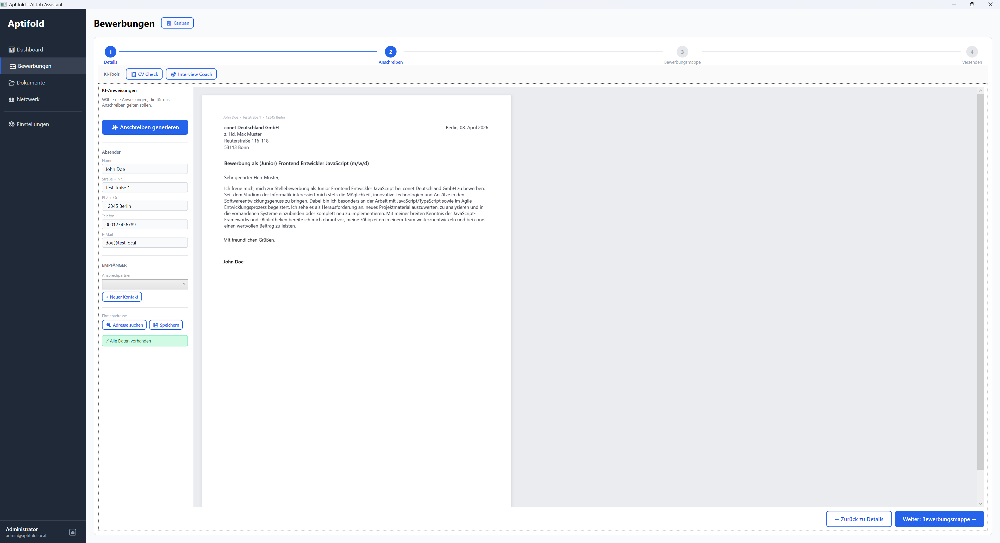

# Hentzware

Softwareprojekte von [Henning Entz](https://github.com/Hentzware).

---

### Aptifold

 

KI-gestützter Bewerbungs-Manager für Windows — **Local-First**: Die Bewerbungsdaten liegen in einer
verschlüsselten SQLite-Datenbank auf dem eigenen Rechner, nicht auf einem Server. Der Server kennt nur
das Konto und leitet KI-Anfragen weiter, ohne sie zu speichern. Dazu Kanban-Board, Postfach über
IMAP/SMTP, Stellen-Scanner, Chrome-Extension zum Übernehmen von Stellenanzeigen und
Anschreiben nach DIN 5008.

| | |
|---|---|
| **Tech Stack** | .NET 10 · WPF (CommunityToolkit.Mvvm) · SQLite (SQLCipher) · ASP.NET Core · MariaDB · Chrome Extension (TypeScript/Vite) · Angular 22 |
| **Status** |  |

**[Mehr erfahren →](Aptifold/README.md)**
