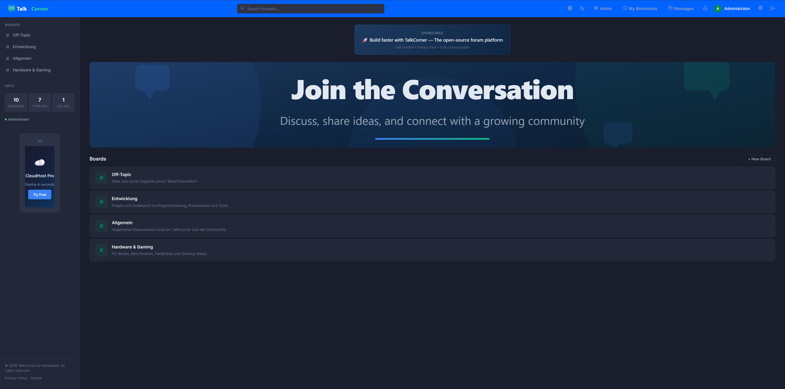

# TalkCorner

  

**TalkCorner** ist eine moderne, selbst gehostete Forenplattform für den Aufbau lebendiger Online-Communities. Sie vereint klassische Forenfunktionen mit Echtzeit-Kommunikation, verschlüsselten Nachrichten und umfangreichen Verwaltungswerkzeugen.

---

## Technologien

| Ebene             | Technologie                                            |
|-------------------|--------------------------------------------------------|
| Backend           | ASP.NET Core 10, Entity Framework Core 10, MediatR     |
| Frontend          | Angular 21 (Standalone Components, Signals)             |
| Datenbank         | PostgreSQL 17                                           |
| Echtzeit          | SignalR (WebSockets)                                    |
| Hintergrundaufgaben | Hangfire                                              |
| Authentifizierung | ASP.NET Identity, JWT, OAuth (Google, GitHub, Discord)  |
| Logging           | Serilog + Seq                                           |
| Containerisierung | Docker Compose                                          |
| CI/CD             | GitHub Actions                                          |

## Features

### Forum

- **Boards, Threads & Beiträge** -- hierarchische Forenstruktur mit Paginierung
- **Markdown-Editor** -- Werkzeugleiste mit Fett, Kursiv, Links, Bildern, Codeblöcken und Zitaten
- **Datei-Uploads** -- Bilder und Dokumente direkt aus dem Editor hochladen
- **Volltextsuche** -- Suche über alle Threads
- **Thread-Verwaltung** -- Threads anheften und sperren
- **Emoji-Reaktionen** -- sechs Reaktionstypen pro Beitrag
- **Thread-Abonnements** -- Threads folgen und Echtzeit-Benachrichtigungen erhalten
- **Gelesen/Ungelesen-Tracking** -- visuelle Hervorhebung neuer Inhalte
- **Beiträge bearbeiten** -- eigene Beiträge nachträglich bearbeiten
- **@Erwähnungen** -- andere Benutzer in Beiträgen erwähnen und benachrichtigen
- **Entwürfe** -- Beiträge automatisch zwischenspeichern
- **Lesezeichen** -- Lieblings-Threads und -Beiträge speichern

### Umfragen

- Einzel- und Mehrfachauswahl
- Konfigurierbares Ablaufdatum mit automatischer Schließung
- Live-Ergebnisanzeige

### Private Nachrichten

- Posteingang & Postausgang
- Serverseitige AES-256-GCM-Verschlüsselung (immer aktiv)
- Optionale Ende-zu-Ende-Verschlüsselung (RSA-2048 + AES-GCM) mit clientseitiger Schlüsselverwaltung

### Benutzersystem

- Registrierung mit E-Mail-Verifizierung
- Benutzerprofile mit Anzeigename, Bio und Avatar
- Aktivitätsverlauf
- Echtzeit-Onlinestatus
- Reputationssystem und Abzeichen
- Benutzergruppen mit eigenen Farben und Icons
- Zwei-Faktor-Authentifizierung (TOTP)
- OAuth-Anmeldung über Google, GitHub und Discord

### Administration

- **Dashboard** -- Statistiken zu Benutzern, Boards, Threads und Nachrichten
- **Benutzerverwaltung** -- Rollenzuweisung, Sperren/Entsperren, Löschung
- **Moderation** -- Threads sperren/anheften, Beiträge löschen, Massenaktionen
- **Meldesystem** -- Meldungen erstellen, prüfen und lösen
- **Audit-Log** -- vollständige Aktionsprotokollierung mit IP-Anonymisierung
- **IP-Sperren & Shadow-Bans** -- flexible Sperroptionen
- **Wortfilter** -- Regex-basierte Inhaltsfilterung
- **Spam-Erkennung** -- Link-Dichte-Analyse, Rate-Limiting, Duplikaterkennung
- **Werbeplätze** -- fünf konfigurierbare Positionen
- **Import** -- Migration von phpBB oder Discourse
- **Backup & Wiederherstellung** -- Datenbanksicherung und -wiederherstellung
- **Analytik** -- tägliche Statistikaggregation
- **Webhooks** -- ereignisgesteuertes Webhook-System mit HMAC-Signierung

### Branding & Anpassung

- Logo, Favicon und Hero-Banner hochladen
- Farbgestaltung mit Primär- und Akzentfarben
- Eigenes CSS einbinden
- Footer mit Copyright-Text und Social-Media-Links

### Benachrichtigungen

- Echtzeit-Benachrichtigungen über SignalR
- Web-Push-Benachrichtigungen
- E-Mail-Zusammenfassungen
- Individuelle Einstellungen pro Benachrichtigungstyp

### Sicherheit

- Rate-Limiting auf mehreren Ebenen
- Security-Header und CORS-Konfiguration
- CSRF- und XSS-Schutz
- Cloudflare Turnstile CAPTCHA

### Weitere Features

- **Internationalisierung** -- Deutsch und Englisch
- **Themes** -- Dark, Light und System
- **Demo-Modus** -- isolierte Instanzen zum Ausprobieren mit automatischem Aufräumen

## Lizenz

Copyright Hentzware. Alle Rechte vorbehalten.
